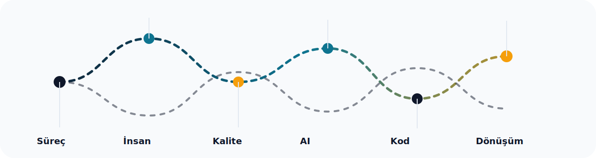

# Merhaba, ben Önder Kaygusuz 👋


Proses Mühendisliği Yöneticisi, İK Lideri ve ISO 9001 Baş Denetçisi olarak **süreç + insan + dönüşüm** ekseninde çalışıyorum; aynı anda **teknolojik güç**, **yapay zeka okuryazarlığı** ve **kodla problem çözme** kaslarını da büyütüyorum.

## Dijital CV Özeti

```text
Misyon: İnsan, süreç ve teknoloji arasında köprü kurmak
Odak: kalite, performans, dijital dönüşüm, AI destekli verimlilik
Stil: ölçülebilir sonuç, sistem kurma, sürdürülebilir gelişim
```

## Güçlü Kökler, Birbirine Bağlı Dallar



## Benim için teknoloji ne demek?

- **Python** ile veri okuma, otomasyon ve küçük araçlar
- **HTML/CSS** ile sunum ve arayüz dili
- **Business Intelligence** ile veriyi karara dönüştürme
- **AI araçları ve prompt aklı** ile boşluk kapatma, hız ve doğruluk
- **Süreç tasarımı** ile insan emeğini tekrar eden yükten kurtarma

## Yapay Zeka ve Kodla Kapattığım Açıklar

| Geleneksel açık | Benim karşılığım |
|---|---|
| Manuel analiz ve yavaş raporlama | Otomasyon, veri toparlama, özetleme |
| Sezgiye dayalı kararlar | Veri destekli doğrulama ve görünürlük |
| Dağınık iş akışları | Kodla sadeleşen, izlenebilir süreçler |
| Tek disiplinli bakış | İnsan + süreç + teknoloji birlikte düşünme |
| Klasik İK uygulamaları | Dijital dönüşüm, performans ve deneyim tasarımı |

## Geleneksel Uzmanlardan Farkım

| Geleneksel yaklaşım | Benim yaklaşımım |
|---|---|
| Bir alanda derin uzmanlık | Birden çok alanı bağlayan sistem bakışı |
| Sorunu tek noktadan çözme | Kök neden, süreç ve teknoloji birlikte |
| Statik raporlar | Hareketli, ölçülebilir ve paylaşılabilir çıktı |
| İnsan veya veri odaklı tek yön | İnsan + veri + süreç dengesini kurma |
| Sadece uygulama | Uygulama + otomasyon + iyileştirme |

## Sektörel Katkım

- **İK**: performans, işe alım, ekip deneyimi, süreç standardı
- **Kalite / ISO**: denetim mantığı, uygunluk, sürdürülebilir iyileştirme
- **Operasyon**: verimlilik, maliyet kontrolü, akış tasarımı
- **Dijital dönüşüm**: iş akışlarını sadeleştirme ve hızlandırma
- **Yönetim**: ölçülebilir sonuç, ekip hizası, karar desteği

## Teknolojik Güç Setim


## Kısa Kod Hikayem

```python
people = "insan"
process = "süreç"
tech = "teknoloji"
result = f"{people} + {process} + {tech} = dönüşüm"
print(result)
```

## Bağlantılar

- LinkedIn: [linkedin.com/in/onderkygz](https://www.linkedin.com/in/onderkygz/)
- E-posta: [onderkygz@gmail.com](mailto:onderkygz@gmail.com)

---

<sub>Bu profil, kişisel marka + dijital CV + hareketli görsel anlatım olarak tasarlanmıştır.</sub>
