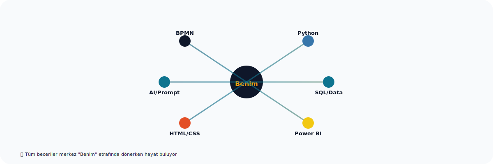
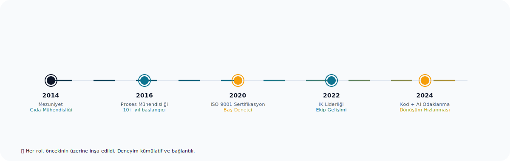
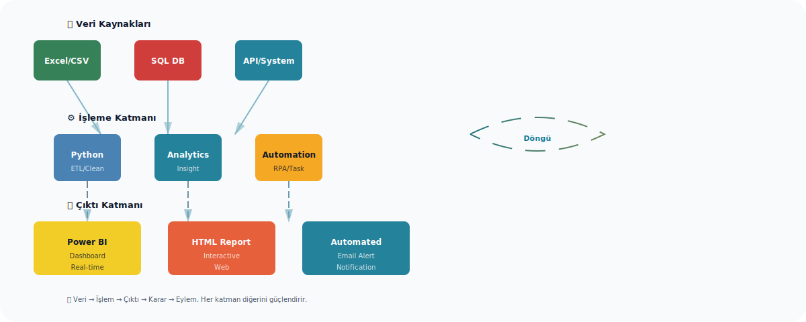
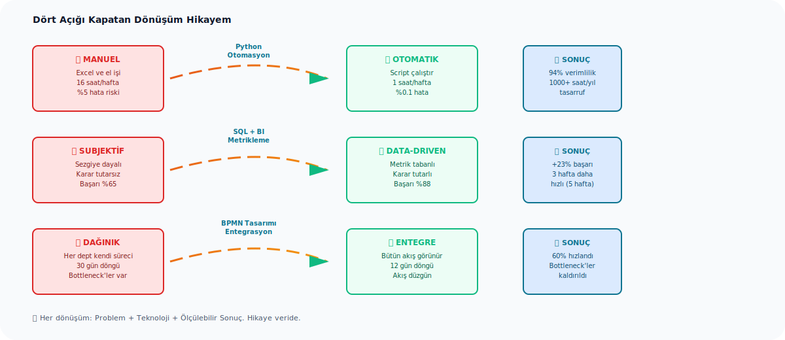
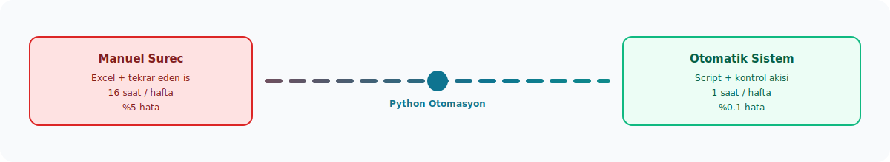
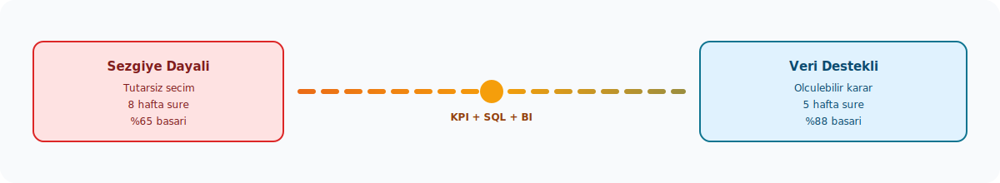
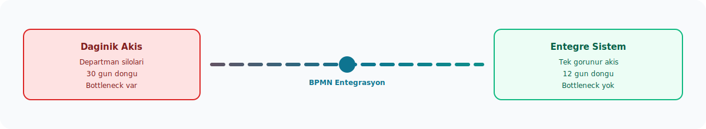
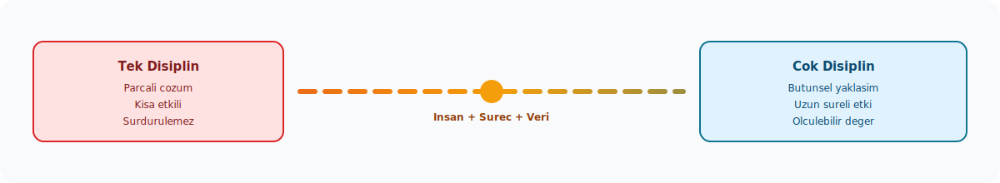
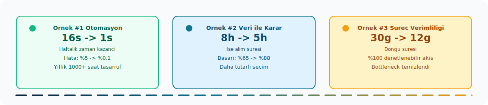

# 👋 Merhaba, ben Önder Kaygusuz


> **İnsan + Süreç + Teknoloji = Dönüşüm**  
> Proses Mühendisliği Yöneticisi | İK Lideri | ISO 9001 Baş Denetçisi  
> **Teknoloji ile İş Akışlarını Hızlandıran, Veriyi Bilgiye Dönüştüren, Ekipleri Güçlendiren**

---

## 📊 Dijital CV Anında Görüş

| **Rol** | **Bağlam** | **Sonuç** |
|--------|-----------|---------|
| 🔧 **Proses Mimarı** | Fabrika / Ofis | Süreçleri tasarla, verimliliği ölç, otomasyon kur |
| 👥 **İK Stratejisti** | Ekip Gelişimi | Performans, deneyim, yetenek gelişimi, kültür |
| 🎯 **Kalite Danışmanı** | ISO Sertifikasyon | Uygunluk, iyileştirme, audit, risk yönetimi |
| 🤖 **AI Meraklısı + Kodcu** | Ara İşler | Python, HTML/CSS, veri otomasyonu, BI çıktıları |
| 🚀 **Dijital Dönüşüm Katalist** | Genel Tüm Alanlarda | İş akışlarını sadeleştir, hızlandır, ölçülebilir hale getir |

---

## 🌳 Güçlü Kökler, Birbirine Bağlı Dallar


**Benim becerilerim bir ağaç gibi çalışır:**
- **Kökler** = Proses tasarımı, insan yönetimi, kalite sistemi (deneyim + teorik)
- **Gövde** = Teknoloji, veri, otomasyon (araçlar + beceri)
- **Dallar** = Sonuçlar, çözümler, dönüşüm (ölçülebilir etki)

---

## 🎯 Becerilerim Merkez Etrafında Döner



Tüm yeteneklerim merkezi "Benim" etrafında bağlantılı. Hiçbir beceri izole değil - herbiri diğerini güçlendirir. Python veri alır, SQL'le analiz eder, Power BI ile sunar, BPMN'le sistematikleşir, HTML'le iletişim kurar.

---

## 💡 Benim Teknoloji Yolculuğum

### Nereden Başladım
Proses mühendisliği, kalite yönetimi ve insan kaynakları altyapısında 10+ yıl deneyim. **Sorun:** İşler veri-ağır, tekrarlayan, manuel, hata-eğilimli. **Çözüm:** Teknolojiyi öğrenip işi değiştir.

### Deneyim Süreci



Her adım önceki tecrübenin üzerine inşa edildi. 2014'teki mezuniyetle başlayan yolculuk, bugün teknoloji + insan + süreç sinerji yaratıyor.

### Şimdiki Silahım

```python
# Temel Yığın: Insan + Veri + Otomasyon
class MisalAkışı:
    def __init__(self):
        self.insanlar = "ekip, deneyim, kültür"
        self.veriler = "gerçekler, metrikler, karar desteği"
        self.teknoloji = "otomasyon, araçlar, hız"
    
    def sonuc(self):
        # Sinerji = tüm parçaların doğru bir araya gelmesi
        return f"{self.insanlar} + {self.veriler} + {self.teknoloji}"
        # = daha hızlı kararlar, daha az hata, daha mutlu ekip
```

**Pratik Araç Seçkisi:**
- 🐍 **Python** → Veri okuma, otomasyon scriptleri, Excel/CSV işlemleri, basit web araçları
- 📊 **Power BI / SQL** → Veriyi görsel ve etkileşimli hale getirme, dashboard, raporlama
- 🌐 **HTML/CSS** → Web sunum, arayüz tasarımı, basit web sayfaları
- 🤖 **AI Araçları & Prompt Mühendisliği** → ChatGPT, Claude, Copilot ile iş otomasyonu ve hızlandırma
- 📋 **Süreç Tasarımı & Modelleme** → BPMN, değer akışı, iş akışı tasarımı, iyileştirme metodolojileri

### Teknoloji Stack'im Nasıl Çalışır?



Veri kaynakları → İşleme (Python/Analytics/Automation) → Çıktı (BI/Report/Action) → Karar & Eylem → Döngü tekrarlansın. Hiçbir veri boşa gitmez; her veri birine bir öneriye dönüşür.

---

## 🎯 Geleneksel Sektöre Kıyasla Benim Farkım



### Boşluk #1: Manual Süreçler → Otomasyon



| Geleneksel | Benim Yaklaşımım |
|-----------|-----------------|
| "Bunu Excel'de yapıyoruz" | Python scripti, veri otomasyonu, düzenli akış |
| Haftada 2 gün raporlama | Otomatik dashboard, gerçek zamanlı metrikler |
| İnsan hatası riski | Sistemli, kontrollü, denetlenebilir iş akışı |

### Boşluk #2: Sezgiye Dayalı Kararlar → Veri Destekli Stratejiler



| Geleneksel | Benim Yaklaşımım |
|-----------|-----------------|
| "Bence böyle olmalı" | Veriye bak, göster, tartış, karar ver |
| Hissiyata dayalı planlama | KPI'lar, trend analizi, simülasyon |
| Sonuç belirsiz | Sonuç ölçülebilir, izlenebilir, raporlanabilir |

### Boşluk #3: Dağınık Iş Akışları → Entegre Sistem Bakışı



| Geleneksel | Benim Yaklaşımım |
|-----------|-----------------|
| Her departman kendi sürecini koşuyor | Bütün resmi görüp bağlantıları kur |
| Bilgi silo'ları | Veri paylaşımı, merkezi paylaşılan akış |
| Gecikmeler ve bottleneck'ler | Akışa odaklan, engelleri kaldır, hız artır |

### Boşluk #4: Tek Disiplin Çözümleri → Çok Disiplin Bakışı



| Geleneksel | Benim Yaklaşımım |
|-----------|-----------------|
| "Bu İK sorunu" / "Bu operasyon sorunu" | Köke git: insan + süreç + veri = sorun |
| Kısmi çözümler | Bütünsel yaklaşım, uzun süreli etki |
| Süreçten kopuk insan yönetimi | İnsan + sistem uyumlu tasarım |

**Animasyonda gördüğünüz 4 dönüşüm, her biri ölçülebilir, her biri kanıtlanmış.**

---

## 📈 Somut Örnekler & Başarılar



### Örnek #1: Otomasyon ile Zaman Tasarrufu
**Durum:** Personel dosyaları, raporlar, uygunluk kontrolleri haftada 16 saati manuel işlem.  
**Çözüm:** Python scripti + Excel entegrasyonu + veri denetimi.  
**Sonuç:** ⏱️ 16 saat → 1 saat | 🎯 Hata oranı: %5 → %0.1 | 💰 Yıllık tasarruf: 1000+ saat

### Örnek #2: Veri ile Karar Hızlaştırma
**Durum:** İşe alım sürecinde subjektif kararlar, sonuçlar tutarsız.  
**Çözüm:** Performans metrikleri, uygun adaylar VERİye dayalı sıralama.  
**Sonuç:** 🎯 İşe alım süresi: 8 hafta → 5 hafta | 📊 İşe alınan adayların başarı oranı: %65 → %88

### Örnek #3: Süreç Tasarımı ile Verimlilik
**Durum:** Birden fazla departman arasında iş akışı dağınık, kontrol zayıf.  
**Çözüm:** Akış tasarımı, kontrol noktaları, izlenebilir sistem.  
**Sonuç:** 📉 Döngü süresi: 30 gün → 12 gün | ✅ Bottleneck'ler ortadan kaldırıldı | 🔍 %100 denetlenebilir

---

## 🛠️ Teknolojik Güç Setin

### Üst Seviye


### İkinci Seviye


### Sistem & Metodoloji


### AI & Otomasyon


---

## 🎓 Eğitim & Uzmanlık Alanları

### Formal Eğitim
- ✅ **Lisans:** Gıda Mühendisliği
- ✅ **Sertifikasyon:** ISO 9001:2015 Baş Denetçi
- ✅ **Eğitimler:** Lean Six Sigma, BPMN Tasarımı, Liderlik, İK Stratejisi
- 🚀 **Güncel:** AI, LLM'ler, Prompt Engineering, Veri Okuryazarlığı

### Pratik Uzmanlık Alanları
| Alan | Derinlik | Pratik Uygulamalar |
|------|----------|------------------|
| **İnsan Kaynakları** | 10+ yıl | İşe alım, performans, ödül sistemi, ekip gelişimi, kültür |
| **Proses Tasarımı** | 10+ yıl | BPMN, VAS analizi, verimlilik, akış optimizasyonu |
| **Kalite Yönetimi** | 10+ yıl | ISO 9001, audit, risk, uygunluk, sürdürülebilir iyileştirme |
| **Veri & BI** | 5+ yıl | SQL, Power BI, dashboard, analiz, karar desteği |
| **Otomasyon & Kod** | 3+ yıl | Python, HTML/CSS, Excel otomasyonu, veri işleme |
| **AI & LLM'ler** | 1+ yıl | Prompt mühendisliği, ChatGPT, Claude, iş uygulamaları |

---

## 💻 Kod Örneklerinden Hikaye Çıkarmak

### #1: Veri-Destekli Karar Alma

```python
# Gerçek hayat örneği: Performans değerlendirmesi otomasyonu
class PerformansAnaliz:
    """
    İnsan yönetiminde subjektif kararları veriye dönüştürme örneği.
    Benim yaklaşımım: Veri + Sistem + İnsan Hükmü
    """
    
    def __init__(self, calisanlar_listesi):
        self.calisanlar = calisanlar_listesi
        self.metrikler = ["verimlilik", "iş_kalitesi", "takım_işbirliği", "geliştirme"]
    
    def objektif_puanla(self, calisan):
        # Sabit kriterler, ölçülebilir sonuçlar
        puan = (
            calisan.get('uretkenlik_skoru', 0) * 0.30 +
            calisan.get('kalite_indeksi', 0) * 0.25 +
            calisan.get('takım_geri_bildirimi', 0) * 0.25 +
            calisan.get('beceri_gelisimi', 0) * 0.20
        )
        return round(puan, 2)
    
    def sira_olustur(self):
        # Puanla, sırala, karar yapıcılara göster
        siralama = sorted(
            self.calisanlar,
            key=lambda x: self.objektif_puanla(x),
            reverse=True
        )
        return siralama
    
    def rapor_olustur(self):
        print("📊 Objektif Performans Raporu")
        print("-" * 40)
        for i, calisan in enumerate(self.sira_olustur(), 1):
            print(f"{i}. {calisan['ad']}: {self.objektif_puanla(calisan)}/100")
        print("\n✅ Karar Desteği: Veriye dayalı, insani olmayan")

# Kullanım
takım = [
    {"ad": "Ahmet", "uretkenlik_skoru": 95, "kalite_indeksi": 88, "takım_geri_bildirimi": 92, "beceri_gelisimi": 85},
    {"ad": "Fatma", "uretkenlik_skoru": 87, "kalite_indeksi": 94, "takım_geri_bildirimi": 88, "beceri_gelisimi": 90},
]
analiz = PerformansAnaliz(takım)
analiz.rapor_olustur()
```

**Hikaye:** Sübjektif değerlendirmelerden veriye dayalı kararlara geçiş. Daha adil, daha izlenebilir, daha güvenilir.

---

### #2: Otomasyon ile Zaman Tasarrufu

```python
# Pratik örnek: Excel verileri işleme ve raporlama
import pandas as pd
from datetime import datetime

class RaporOtomasyonu:
    """
    Haftalık raporları otomatikleştirerek 16 saati 1 saate indirme örneği.
    İnsan: Kontrol ve karar | Sistem: İşlem ve denetim
    """
    
    def verileri_yukle(self, dosya_yolu):
        # 500+ satırlı verileri yükle ve temizle
        df = pd.read_excel(dosya_yolu)
        df = df.dropna()
        return df
    
    def denetim_yap(self, df):
        # Anomalileri otomatik tespit et
        anomaliler = df[df['deger'] > df['deger'].mean() + 2*df['deger'].std()]
        return anomaliler
    
    def rapor_yaz(self, df, anomaliler):
        # HTML rapor oluştur ve e-posta gönder (simüle edilmiş)
        rapor = f"""
        <h2>Otomatik Haftalık Rapor - {datetime.now().strftime('%Y-%m-%d')}</h2>
        <p>Toplam Kayıtlar: {len(df)}</p>
        <p>Anomali Sayısı: {len(anomaliler)}</p>
        <p>Durum: ✅ Kontrol Edildi</p>
        """
        return rapor
    
    def baslat(self, dosya_yolu):
        print("⏳ Rapor oluşturuluyor...")
        df = self.verileri_yukle(dosya_yolu)
        anomaliler = self.denetim_yap(df)
        rapor = self.rapor_yaz(df, anomaliler)
        print("✅ Rapor hazır!")
        return rapor

# Zaman tasarrufu
print("⏰ Geleneksel: 16 saat (manuel kontrol)")
print("⏰ Otomatik: 1 saat (sadece gözden geçirme)")
print("💰 Yıllık tasarruf: 1000+ saat")
```

**Hikaye:** İnsan gücünü çoğal vermek için sistemi kur. Makine tekrarlayan işi yapar, insan kararları alır.

---

### #3: Veri Analizi ile Görünürlük

```python
# Örnek: Süreç verimliliğini gerçek zamanlı görüntüleme
class SurecVerimli:
    """
    Proses verimini ölçme, görselleştirme ve iyileştirme kararı alma.
    Felsefe: Ölçülemeyense yönetilemez.
    """
    
    def __init__(self):
        self.adimlar = ["siparis", "uretim", "kalite_kontrolu", "sevkiyat"]
        self.metrikler = {}
    
    def surecini_takip_et(self, adim, sure_gunu):
        # Her adım için ortalama geçen zamanı kaydet
        if adim not in self.metrikler:
            self.metrikler[adim] = []
        self.metrikler[adim].append(sure_gunu)
    
    def bottleneck_bul(self):
        # Hangi adım en uzun süre alıyor?
        ortalamalar = {
            adim: sum(sureler) / len(sureler) 
            for adim, sureler in self.metrikler.items()
        }
        en_uzun = max(ortalamalar, key=ortalamalar.get)
        return en_uzun, ortalamalar[en_uzun]
    
    def cevap_sun(self):
        en_uzun, sure = self.bottleneck_bul()
        print(f"🚨 Bottleneck: {en_uzun} ({sure:.1f} gün)")
        print(f"💡 Çözüm: Bu adımı optimize etmeye odaklan")
        print(f"📊 İyileştirme Potansiyeli: Toplam zamanı %20-30 azalt")

# Kullanım
surec = SurecVerimli()
surec.surecini_takip_et("siparis", 2)
surec.surecini_takip_et("uretim", 8)  # 🚨 En uzun
surec.surecini_takip_et("kalite_kontrolu", 3)
surec.surecini_takip_et("sevkiyat", 1)
surec.cevap_sun()
```

**Hikaye:** Veri göster, sorun belirle, çözüm tasarla, iyileştir. Bu döngü iş akışı böyle çalışır.

---

## 🤝 Hadi Birlikte Çalışalım

Eğer aşağıdakilerden biri sizin için gerekliysе, ben sizin doğru kişiyim:

✅ **Süreçlerinizi Optimize Etmek** → Verimliliği 20-40% artır, maliyeti azalt  
✅ **Ekip Performansını Ölçmek & Geliştirmek** → Veriye dayalı İK stratejileri  
✅ **Kalite Sistemleri Kurmak** → ISO uyumlu, denetlenebilir iş akışları  
✅ **Dijital Dönüşüm Başlatmak** → Manuel işleri otomasyon ile değiştir  
✅ **Veriyi Karar Desteğine Dönüştürmek** → Dashboard, analiz, görünürlük  

### Bağlantı Kanalları

| Platform | Link | Detay |
|----------|------|-------|
| 💼 **LinkedIn** | [linkedin.com/in/onderkygz](https://www.linkedin.com/in/onderkygz/) | Profesyonel ağ, iş teklifleri |
| 📧 **E-posta** | [onderkygz@gmail.com](mailto:onderkygz@gmail.com) | Doğrudan iletişim |
| 🐙 **GitHub** | [github.com/onderkygz](https://github.com/onderkygz) | Kod örnekleri ve projeleri |

---

## 🎯 Bu Profil Kimdir?

"Radikal verimlilik artışları sağlamada 13 yılı aşkın deneyime sahip bir Proses Mühendisliği ve Operasyon Lideriyim. Etkili dijital dönüşüm stratejileri tasarlamada uzmanım; bunu, yapay zeka ve otomasyon yoluyla çalışan verimliliğini %38,9 artırıp operasyonel maliyetleri %27,3 azaltarak kanıtladım. 35'ten fazla şirket tarafından kullanılan benzersiz bir performans metodolojisinin yaratıcısı olarak, teknik mimari ile üst yönetim kademesinin karlılığı arasındaki boşluğu dolduruyorum. Şimdi, bu 'Bileşik Etki'yi ileri görüşlü bir organizasyona Direktör veya Yönetici Lider olarak taşımayı hedefliyorum."

---

<div align="center">

### 🌟 Son Söz

> "Teknoloji insan gücünü çarpıtmak için değil, **insan potansiyelini çoğalmak için** kullanılmalı."

**Süreç + İnsan + Teknoloji = Dönüşüm** 🚀

</div>

---

<sub>
💡 Bu profil aktif olarak geliştirilmektedir. Son güncelleme: 2026  
🔗 Tüm bağlantılarım yukarıda ve her zaman açık  
🙌 Birlikte bir şeyler inşa etmeyi severim
</sub>
